# am_spinin

---

Amos Spinner Input Firmware for Arduino &amp; ATtiny85


Arkanoid와 같은 게임의 경우, 주입력 장치로 스피너를 사용한다.
이 스피너를 구현하기 위해서는 Rotary Encoder와 같은 장치를 사용하면 된다. 이때 사용할 Rotary Encoder는 RPM 측정용 단상형이 아니라, 양방향 회전을 위한 2상형 이상을 사용해야 하며, 해상도는 최소 100 P/R 이상이어야 한다. 사실 고전 아케이드 게임이 목적이라면 그 이상의 고해상도를 필요로 하지 않는다.

Rotary Encoder는 다음과 같은 형태로 주로 판매되고 있다.

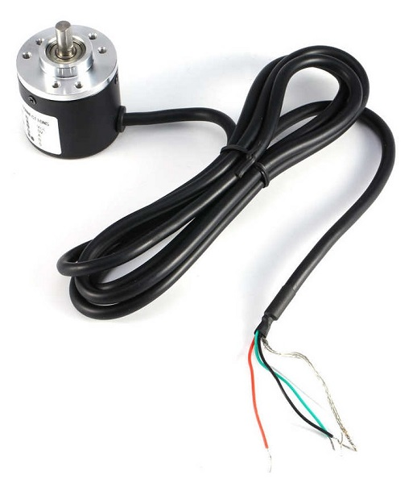

출력핀은 총4개로, VCC, GND의 전원핀 외에 A, B 핀이 존재한다. 전원은 보통 5V~24V이다.

이를 실제로 이용하기 위해서는 Rotary Encoder 컨트롤러가 필요하다. 컨트롤러는 LS7366R과 같은 카운터칩을 사용하는 것이 제일 좋긴 하지만, 별도 모듈로 판매되는 것을 찾기 힘들고, 별도의 엔코더 카운터 보드를 구매할 경우 산업용이라 부담스러운 가격대이기에 게임기에 사용하기엔 부적절하다.
어차피 사람의 손 움직임을 입력 받는 것이기 때문에 고속, 고정밀 컨트롤러가 필요하진 않기에, Arduino 정도의 성능으로도 충분히 스피너용 컨트롤러를 만들 수 있다.

아두이노 레오나르도를 사용하게 되면 마우스 장치로 동작하기 때문에 그냥 라즈베리파이의 USB 단자에 연결하는 것만으로 별도의 드라이버 없이 동작하게 할 수 있다.

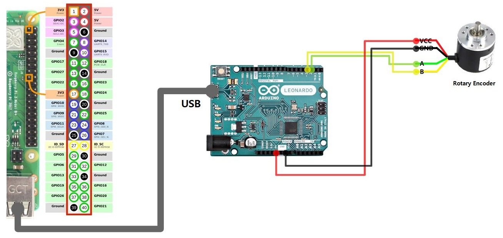

아두이노 레오나르도 정품보다는 SparkFun사의 프로마이크로를 사용하는 경우가 많다. 가격도 더 저렴하고 크기도 더 작아서 게임기에 내장하기엔 더 유리하다.

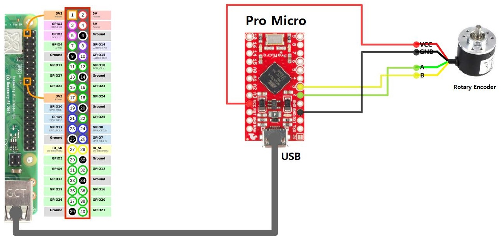

프로마이크로의 클론 제품들이 많이 있다. 불행히도 이런 클론 제품들은 전원 파트가 그리 좋지 못 한 편이다. 이런 제품들의 경우 부하가 걸렸을 때 VCC의 전압이 5V 미만으로 나오는 경우가 많다. 이 경우엔 Rotary Encoder가 동작하기에 충분한 전압이 공급되지 않아서 정상적인 동작을 하지 않게 된다.

이럴 땐 Rotary Encoder의 VCC를 프로마이크로가 아닌 라즈베리파이의 5V 핀으로부터 공급받도록 하면 된다.

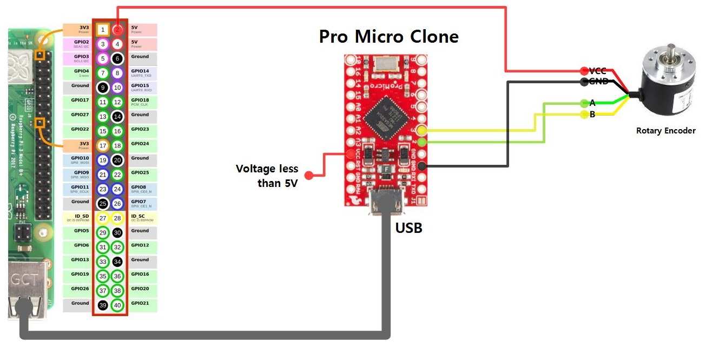

아두이노 레오나르도를 사용할 경우엔 USB 포트를 한개 점유한다는 단점이 있다. 이는 동시에 라즈베리파이의 노출 된 후면 부분을 디자인적인 단점으로도 이어진다.
또한 한번 펌웨어의 기록이 끝난 후엔 사후에 설정을 변경한다거나 기능을 변경하는 것에 제약이 걸린다.

이를 해결하기 위해 아두이노는 Rotary Encoder의 카운팅만을 전담하고, 이를 라즈베리파이에 전달하여 실제 마우스 장치 등으로 재현하는 것은 드라이버를 통해서 하는 방법을 생각해 볼 수 있다. 이 경우엔 앞서의 경우보다 제작 난이도는 좀 더 올라가긴 하지만 훨씬 유연하게 장치를 운영할 수 있다.

실제로 컨트롤러로 사용할 보드는 Arduino Pro Mini이다.

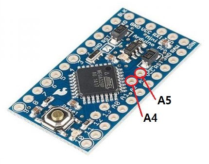

펌웨어 업로드가 완료 되면 해당 컨트롤 보드에 결선을 시작한다.
Rotary Encoder의 A, B 핀은 보드의 GPIO 2번과 3번 핀에 각각 연결한다.

컨트롤 보드의 A4, A5핀이 I2C용 핀이며, 각각 SDA, SCL 핀이다.

라즈베리파이에 연결시, I2C 핀, 혹은 SPI 핀에 연결해 주면 된다.

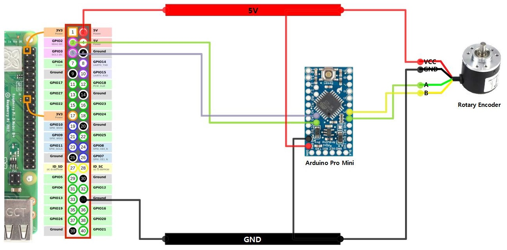

단, 아두이노가 5V 버전일 경우, 라즈베리파이는 3.3V를 사용하기 때문에 이를 다이렉트로 연결하면 문제가 생길 가능성이 있다. 만약 아두이노가 3.3V 버전이라면 라즈베리파이와는 문제가 없겠지만, 대신 로터리 엔코더가 5V를 사용하기 때문에 역시 문제가 생길 가능성이 있다.

비록 신호선이기에 전류의 크기가 크지 않고, 신호 레벨로는 3.3V나 5V나 0과 1이 명확할 경우엔 레벨값을 서로 동일하게 인식 가능하기 때문에 당장은 잘 동작하는 것처럼 보일 수 있다. 하지만 지속적으로 오버 된 전압이 계속 가해질 경우 장기적으로는 보드에 무리를 줄 수 있기에, 가급적 서로의 전압에 맞춰 신호 전압 레벨을 변환해 주는 Level Converter라는 것을 사용하는 것이 좋다.

레벨 컨버터는 단방향, 양방향, 2채널, 4채널 등등... 몇가지 종류가 있다.
시리얼 통신처럼 RX와 TX가 명확히 구분되어 있는 경우엔 단방향을 쓰면 되나, I2C처럼 읽기와 쓰기를 모두 같은 핀이 담당할 경우엔 양방향을 써야 한다. 또한 SPI처럼 섞여 있는 경우엔 적절히 섞어 쓰거나 그냥 양방향으로 통일해도 된다.

신호에 사용하는 선의 갯수에 따라 채널의 갯수를 선택하면 된다. 기본적으로 시리얼 통신, I2C는 2채널, SPI는 4채널이 필요하다.
(전원 레귤레이터랑은 다르다. 전원선에 이걸 연결하면 안 되고, 오직 신호선에만 이용해야 한다.)

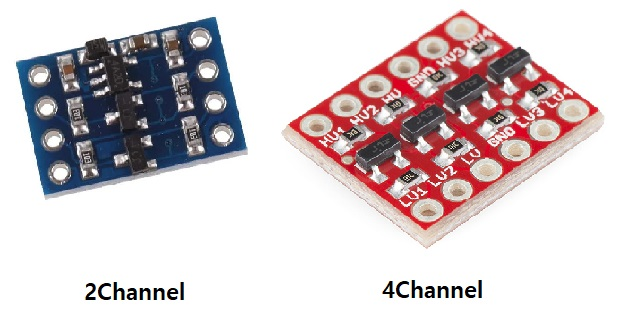

아두이노가 5V 버전일 경우, 아두이노와 라즈베리파이 사이에 신호 레벨 컨버터를 위치시킨다.

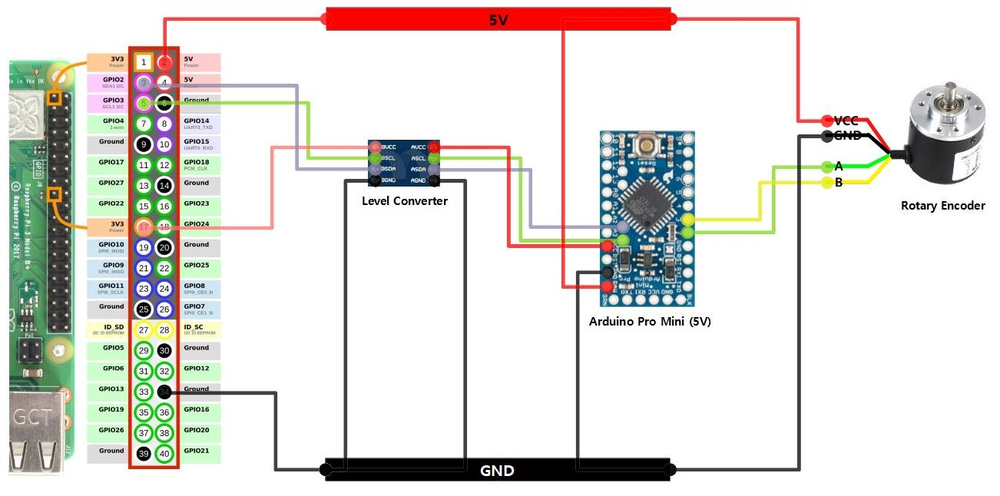

만약 아두이노가 3.3V 버전이라면 라즈베리파이와는 다이렉트로 연결하고 대신 로터리 엔코더에서 오는 신호를 3.3V로 변환해 주기 위해서 신호 레벨 컨버터를 달아야 한다. (이 경우엔 단방향 레벨 컨버터를 사용해도 된다.)

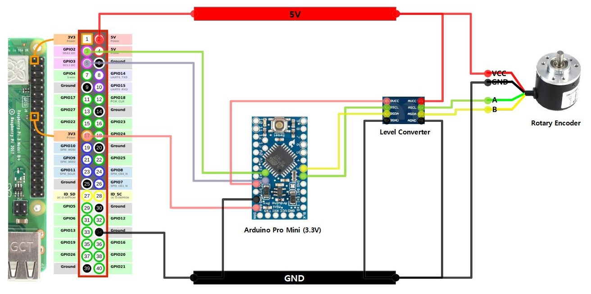

단순히 단방향 신호의 전압 강하이기 때문에 레벨 컨버터가 없다면 저항비를 이용해 이를 대신할 수 있다. 저항의 비율은 5V를 3.3V로 낮추는 것이기 때문에 R1:R2 비율은 17:33의 비율이면 된다.

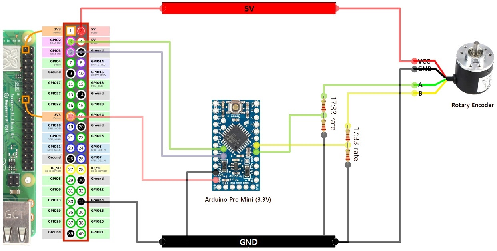

아두이노 보드 외에도 원칩 솔루션인 ATtiny85를 사용할 수도 있다.

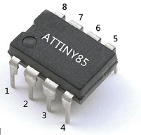

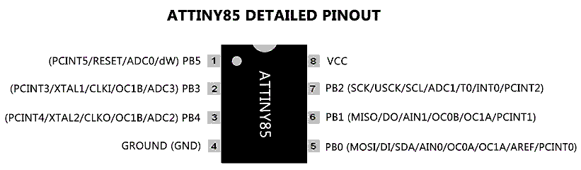

ATtiny85를 이용할 경우, 아두이노 보드의 쓸 때에 비해 크기면에서 유리하다. 또한 ATtiny85의 경우엔 동작 전원이 1.8V에서 5.5V까지 수용할 수 있기 때문에, 3.3V와 5V 중 하나를 선택해서 회로를 구성할 수 있다. 여기에선 3.3V를 기준으로 삼았다. 단, ATtiny85를 3.3V로 동작시킬 경우, 5V에 비해 동작 클럭이 더 떨어지게 되는데, 그래도 3.3V에서도 12MHz로 동작시킬 수 있으니 아케이드 게임 입력용으로는 충분하다.

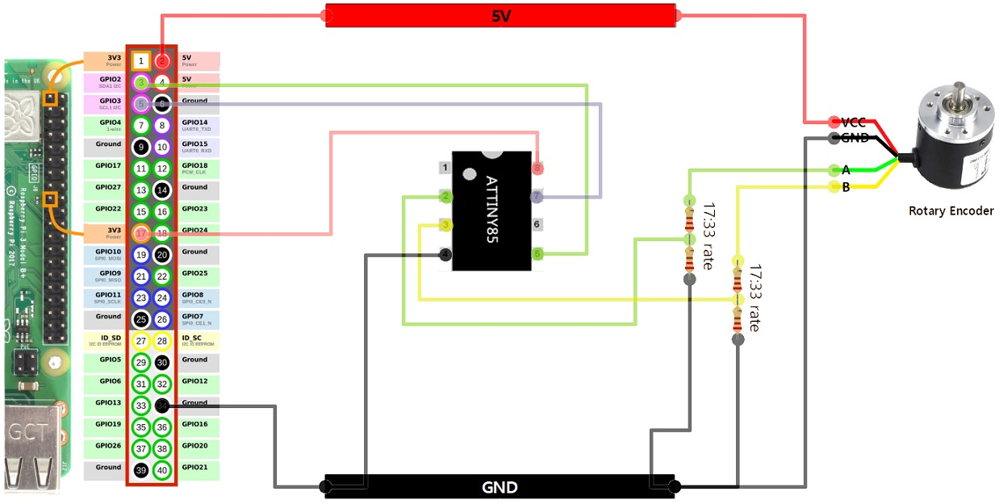


빌드 전에, src/main.cpp 상의 다음의 설정을 조정해 준다.
조정할 대상은 I2C 주소와 Rotary Encoder의 P/R 값 등이다.
참고로, 해당 값들 중 일부는 I2C나 Serial 커맨드 등으로 사후 조정도 가능하다.

```c++
// User Setting
//=========================================================================
#define USE_DEBUG                       /// for Debugging

#define USE_I2C                         /// use I2C
#define USE_SPI                         /// use SPI
#define USE_SERIAL                      /// use Serial (Command Shell)

#define USE_EEPROM                      /// use EEPROM

#define DEFAULT_I2C_ADDR      (0x34)    /// default i2c address

#define DEFAULT_ROTARY_PPR    (100)     /// default rotary encoder P/R
#define DEFAULT_MOUSE_DPI     (1000)    /// default mouse resolution D/I
#define DEFAULT_SAMPLE_RATE   (10)      /// default sample rate (ms)

#define USE_A_B_BOTH_INTRP              /// use a, b pin interrupt
#define USE_CHANGE_INTRP                /// use pin change interrupt

#define DEVICE_TYPE_MOUSE     (0)
#define DEVICE_TYPE_JOYSTICK  (1)
#define DEVICE_TYPE           (DEVICE_TYPE_MOUSE)  /// DEVICE_TYPE_MOUSE or DEVICE_TYPE_JOYSTICK
//=========================================================================
```

현재 지원하는 보드에 해당하는 설정 predefine 이다.

| predefine   | 지원 보드                                | 인터페이스         | 입력핀   |
|-------------|------------------------------------------|-------------------|----------|
| uno         | Arduino Uno                              | I2C, SPI, Serial  | A:2, B:3 |
| promini_5v  | Arduino Pro Mini 5V                      | I2C, SPI, Serial  | A:2, B:3 |
| promini_3v3 | Arduino Pro Mini 3.3V                    | I2C, SPI, Serial  | A:2, B:3 |
| leonardo_5v | Arduino Leonardo, SparkFun Pro Micro 5V  | USB, Serial       | A:2, B:3 |
| attiny85    | ATtiny85                                 | I2C               | A:3, B:4 |


각 인터페이스 별 지원 커맨드들은 다음과 같다.

* Serial

문자열 포맷으로 되어 있고, 각 커맨드는 CR 문자로 끝난다.

| command | R/W | 설명 | 타겟 |
|---------|-----|------|------|
| help | Read | 도움말 
| version | Read | 버전
| val | Read | 현재 로터리 카운트 값 읽기
| val:00000 | Write | 현재 로터리 카운트 값 쓰기
| intv | Read | 샘플링 주기 읽기
| intv:00000 | Write | 샘플링 주기 쓰기
| ppr | Read | 로터리 엔코더 Pulse/Revolution 읽기 | 마우스
| ppr:00000 | Write | 로터리 엔코더 Pulse/Revolution 쓰기 | 마우스
| dpi | Read | 마우스 Dot/Inch 읽기 | 마우스
| dpi:00000 | Write | 마우스 Dot/Inch 쓰기 | 마우스
| min | Read | 조이스틱 최소값 읽기 | 조이스틱
| min:00000 | Write | 조이스틱 최소값 쓰기 | 조이스틱
| max | Read | 조이스틱 최대값 읽기 | 조이스틱
| max:00000 | Write | 조이스틱 최대값 쓰기 | 조이스틱

결과값은 다음의 포맷을 갖고 있다.

성공시
```
suc:결과값 or 메시지
```

실패시
```
err:메시지
```


* I2C

- Read : 현재의 count 값

- Write : 3바이트로 이루어진 커맨드 포맷을 갖고 있다.

|  0번째  |  1번째     |  2번째       |
|:-------:|:----------:|:-----------:|
| command | 상위 바이트 | 하위 바이트 |

각 command에 대한 설명이다.

| command | 설명 | 타겟 |
|---------|------|------|
| 0x41 | write value
| 0x42 | set mode
| 0x43 | set sample rate
| 0x44 | set min value | 조이스틱
| 0x45 | set max value | 조이스틱
| 0x4F | set i2c address

* SPI

SPI 인터페이스는 3바이트로 이루어져 있고, 포맷은 다음과 같다.

|  0번째  |  1번째     |  2번째       |
|:-------:|:----------:|:-----------:|
| command | 상위 바이트 | 하위 바이트 |

각 command에 대한 설명이다.

| command | 설명 | 타겟 |
|---------|------|------|
| 0x00 | read value
| 0x41 | write value
| 0x42 | set mode
| 0x43 | set sample rate
| 0x44 | set min value | 조이스틱
| 0x45 | set max value | 조이스틱
| 0x4F | set i2c address


Arduino Leonardo 계열처럼 USB 인터페이스를 사용하지 않는 경우, 실제로 Rotary Encoder의 카운트 값을 받아서 마우스 장치로 동작하게 하기 위해서는 별도로 전용 드라이버가 존재해야 한다.

라즈베리파이의 경우, am_joyin 이라는 드라이버를 설치해서 사용하면 된다. 해당 드라이버는 다음의 링크에서 받을 수 있다.

> [am_joyin 라즈베리파이 아케이드 조이스틱 드라이버](https://github.com/amos42/am_joyin)

드라이버가 정상적으로 동작한다면 Rotary Encoder는 일종의 마우스처럼 동작할 것이다.
때문에 게임에서 이를 사용하기 위해서는 마우스 입력이 가능하도록 설정을 조정해 줘야 한다.

이를테면, Arkanoid 등의 게임은 RetroArch 설정에서, mouse 지원을 추가해 주면 된다.

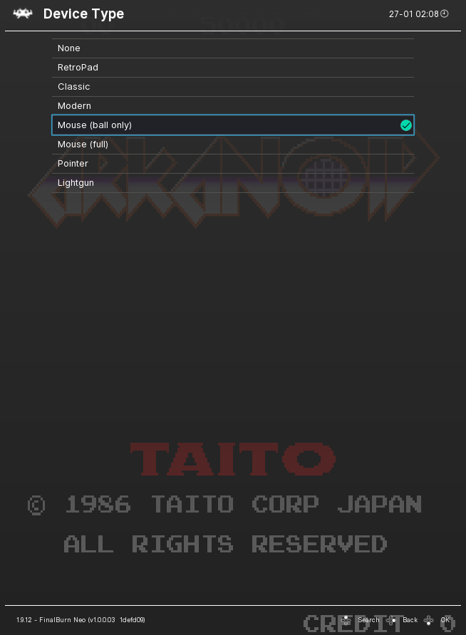
